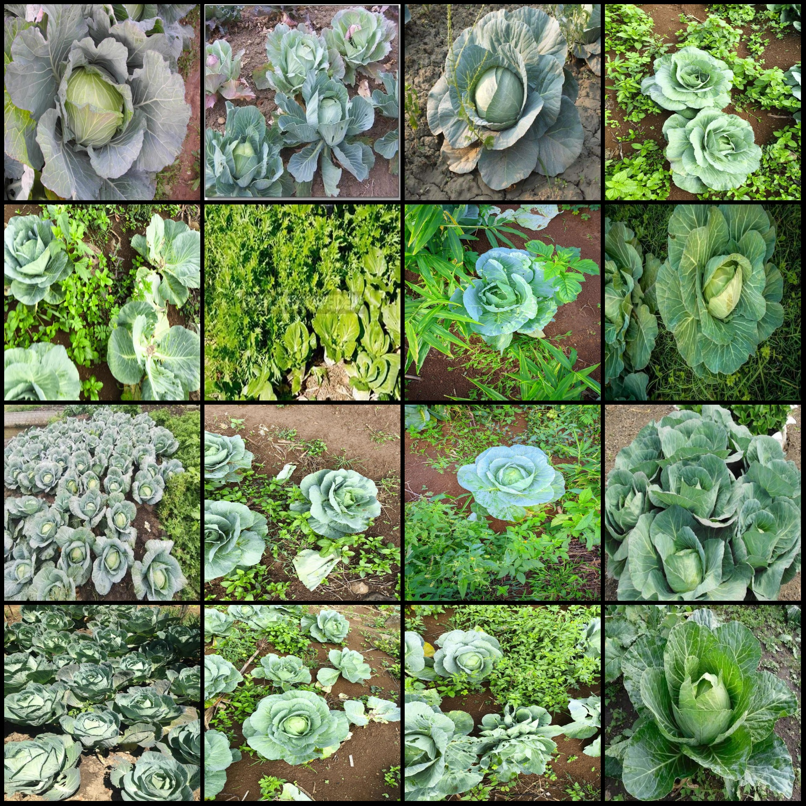
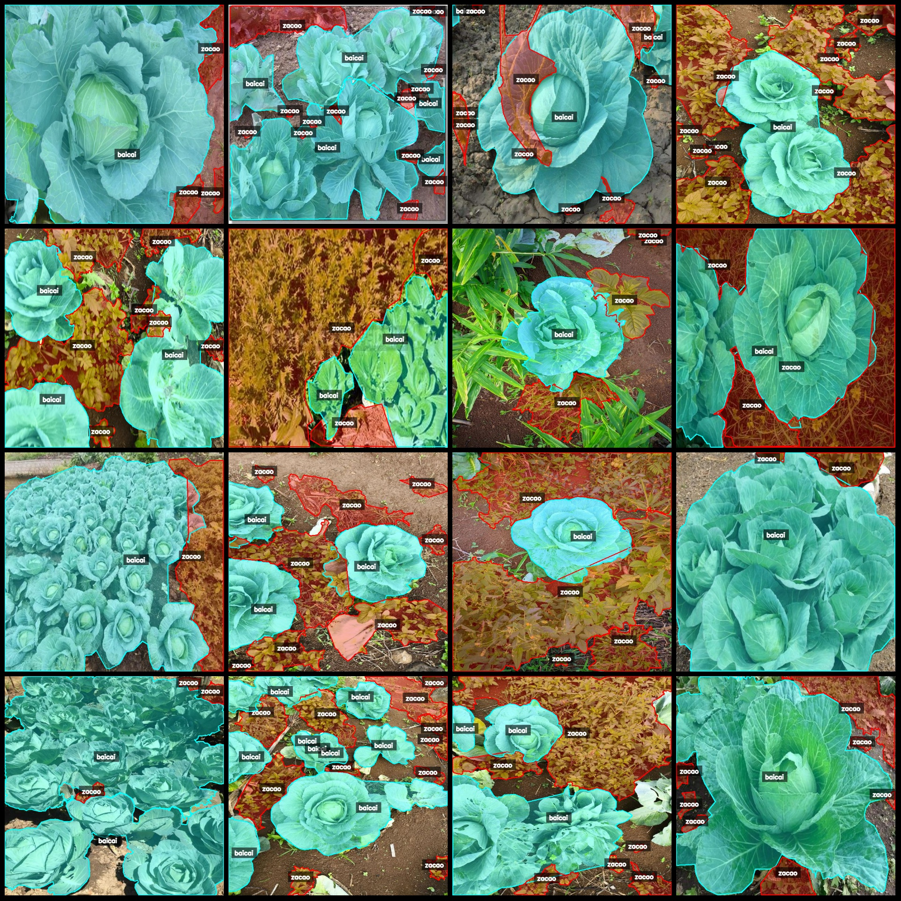
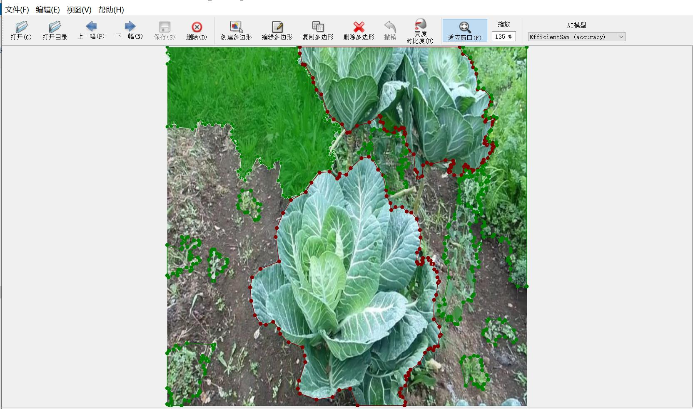

# Large cabbage and weed identification and segmentation dataset in labelme format with 2006 images of 2 classes

Dataset format: labelme format (excluding mask files, only containing jpg images and corresponding json files)  
Number of image files (number of jpg files): 2006  
Number of annotation files (number of json files): 2006  
Number of annotation categories: 2  
Annotation category names: ["baicai", "zacao"]  
Number of polygons for each category:  
- baicai (cabbage) count = 4552  
- zacao (weed) count = 11669  
Total number of polygons: 16221  
Used annotation tool: labelme=5.5.0  
Image resolution: 640x640  
Annotation rules: draw polygons for the categories  
Important notes: The dataset can be opened and edited using labelme, but the json dataset needs to be converted into either mask or yolo format or coco format for semantic segmentation or instance 
segmentation  
Special declaration: This dataset does not guarantee the accuracy of the trained models or weight files  
Image previews:  
Annotation examples:  
Selected 16 images for annotation:  
Annotation drawing results:  
Labelme editing example image:

## Images

Here is a pay link on Stripe ( https://buy.stripe.com/3cs8yP7sY87d0vu9AB ). Please contact me lonlonago@foxmail.com after funding $89, and I will send you a complete data files , thank you!

